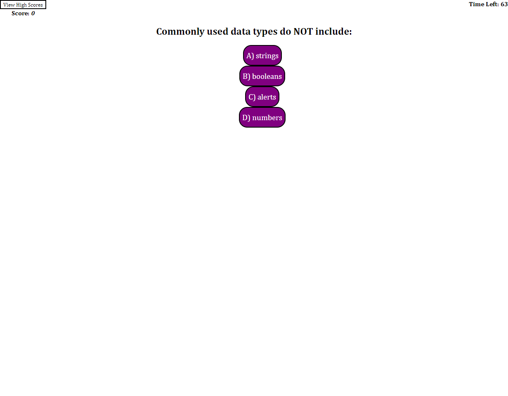

# 04 Web APIs - John Mabie

For this homework challenge, the Web API Code Quiz, there were a few hurdles.
Firstly, I was not sure how to create an array of all available answers from which an event Listener could parse the specific button clicked, then test that specific answer against the given correct answer in the question array. Was not able to resolve this without creating four separate event Listeners for each of the given answer buttons, which all operate almost identically. Going to see if I can resolve this in one function through office hours and tutoring but at time of challenge submission, the operation is still being done with 4.

Secondly, for the "Clear" button shown in the demo GIF given in the Challenge Assets, I was able to create a button which cleared the leaderboard on that page prior to selecting "Go Back", but if the user elects to hit "View Leaderboard" again, the previously cleared leading scores will reappear. I used an array for the leaderboard, and neither an empty array nor empty quotations were able to fully clear the leaderboard upon revisiting. I also struggled with creating a leaderboard which numbered the leading scores, let alone ranked them. As I have it upon submission, all leading scores are listed in a single line, with no order to the scores. Going to see if I can resolve this through office hours and tutoring.

Thirdly, I was able to create functional answer buttons for all 4 options per every question presented by the quiz, correct answers and incorrect answers return accurately with their respective UserAnswer responses, and the timer is correctly penalized whenever there is an incorrect answer selected. However, I cannot seem to get the answer buttons themselves to properly center on the page. I've tried a few different tricks to try and get them aligned, but nothing seems to truly center them. Going to see if I can resolve this through office hours and tutoring.

Lastly, I was able to create UserAnswer responses which let the user know whether their most recent answer was correct or incorrect. I was able to have these messages pop up briefly and then disappear after a moment, but the method I used (a setTimeout leading into a innerHTML = "") seems to cause a negative response in the Console log of the application, as the code technically *works* and achieves the desired function, something about the "" reset output is apparently not the ideal way to go about this. Going to see if I can resolve this through office hours and tutoring.

As it currently functions:
Every aspect of the GIVEN/WHEN/THEN prompts in the Challenge README are succesfully implemented into the application. Quiz has a 75 second timer which doesn't start until the user selects the "Start" button, and which is deducted by 10 seconds for every incorrect answer selected by the user. Quiz has five multiple-choice questions and all answer selection buttons work correctly. User can type their initials or their name into the Leaderboard upon completion of the Quiz and save their score into the Leaderboard.

A screenshot of the application when opened in Google Chrome can be seen below:

This screenshot is as of 1/9/2023 at 11PM CST, will add updated screenshot(s) once adjustments have been made by way of office hours and tutoring.

A link to the deployed application can be found below:
https://jmabie94.github.io/1-9-22-webAPI-code-quiz/
