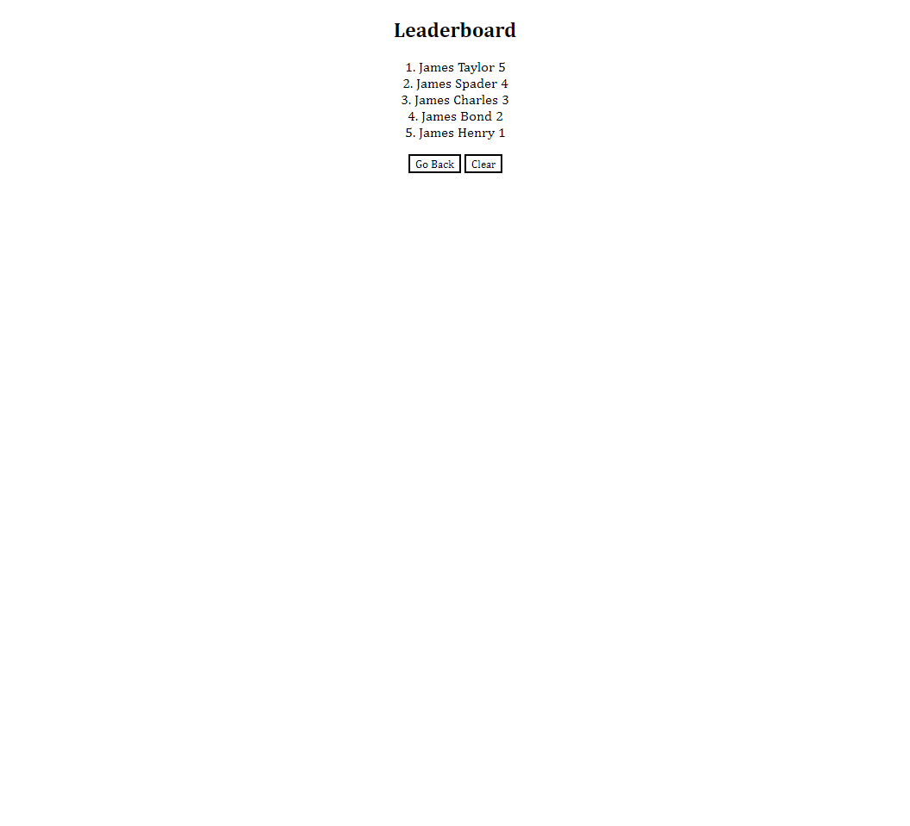

# 04 Web APIs - John Mabie

For this homework challenge, the Web API Code Quiz, there were a few hurdles.
#1 Firstly, I was not sure how to create an array of all available answers from which an event Listener could parse the specific button clicked, then test that specific answer against the given correct answer in the question array. Was not able to resolve this without creating four separate event Listeners for each of the given answer buttons, which all operate almost identically. Going to see if I can resolve this in one function through office hours and tutoring but at time of challenge submission, the operation is still being done with 4.

#2 Secondly, for the "Clear" button shown in the demo GIF given in the Challenge Assets, I was able to create a button which cleared the leaderboard on that page prior to selecting "Go Back", but as I had it upon initial submission, all leading scores were listed in a single line, with no order to the scores. (Removed excess text explaining fixed problems)

UPDATE TO #2: With help in office hours, got the Leaderboard to clear properly, and the submissions to the leaderboard are now numbered and correctly ranked. The styling has been adjusted and specified so that the leaderboard results are correctly centered on the page.

#3 Thirdly, I was able to create functional answer buttons for all 4 options per every question presented by the quiz, correct answers and incorrect answers return accurately with their respective UserAnswer responses, and the timer is correctly penalized whenever there is an incorrect answer selected. (Removed excess text explaining fixed problems)

UPDATE TO #3: With help in office hours, all of the buttons are now perfectly centered on the page!

#4 Lastly, I was able to create UserAnswer responses which let the user know whether their most recent answer was correct or incorrect. (Removed excess text explaining fixed problems)

UPDATE TO #4: Upon entry of any correct answer, there was a mistaken ID of "UserResponse" rather than "UserAnswer" which was causing the notification of correct answers to not time out appropriately and show an issue in the console log. 

As it currently functions:
Every aspect of the GIVEN/WHEN/THEN prompts in the Challenge README are succesfully implemented into the application. Quiz has a 75 second timer which doesn't start until the user selects the "Start" button, and which is deducted by 10 seconds for every incorrect answer selected by the user. Quiz has five multiple-choice questions and all answer selection buttons work correctly. User can type their initials or their name into the Leaderboard upon completion of the Quiz and save their score into the Leaderboard.

A screenshot of the application when opened in Google Chrome can be seen below:

This screenshot is as of 1/9/2023 at 11PM CST, will add updated screenshot(s) once adjustments have been made by way of office hours and tutoring.

A screenshot of the application when opened in Google Chrome can be seen below:

This screenshot is as of 1/10/2023 at 1AM CST, will add updated screenshot(s) if any further adjustments are made, though as of this time 3/4 of the problems I was running into were fixed in office hours.

A link to the deployed application can be found below:
https://jmabie94.github.io/1-9-22-webAPI-code-quiz/
